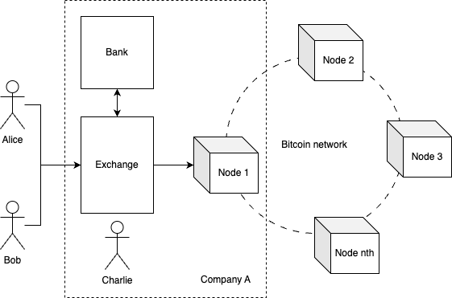
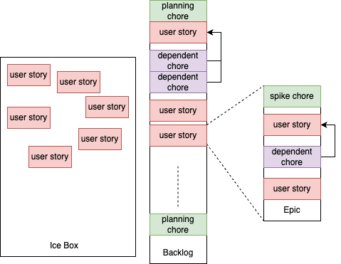
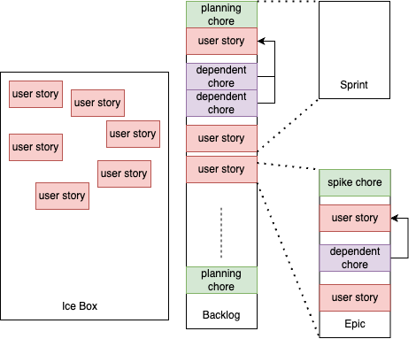
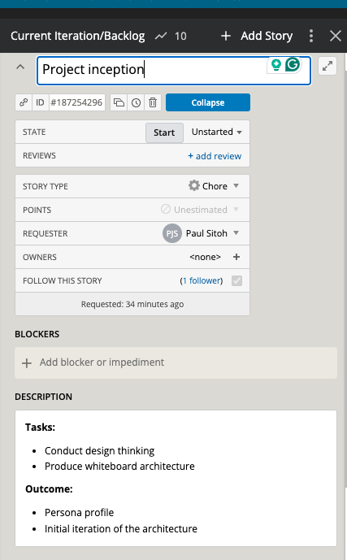
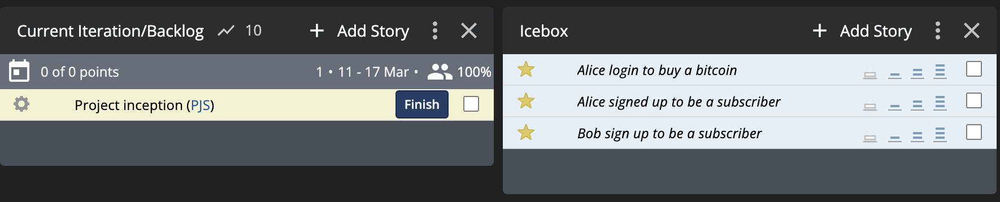
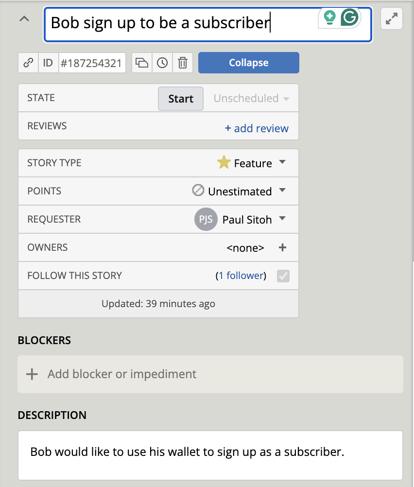
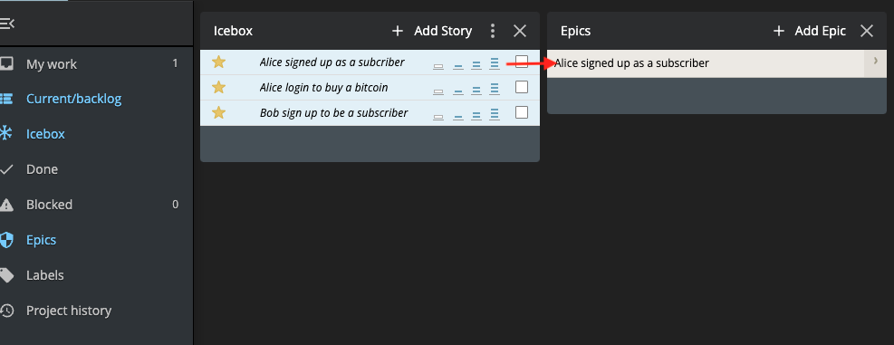
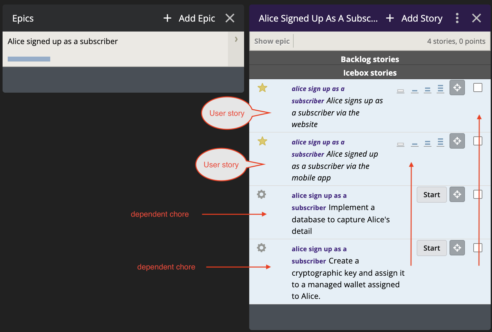
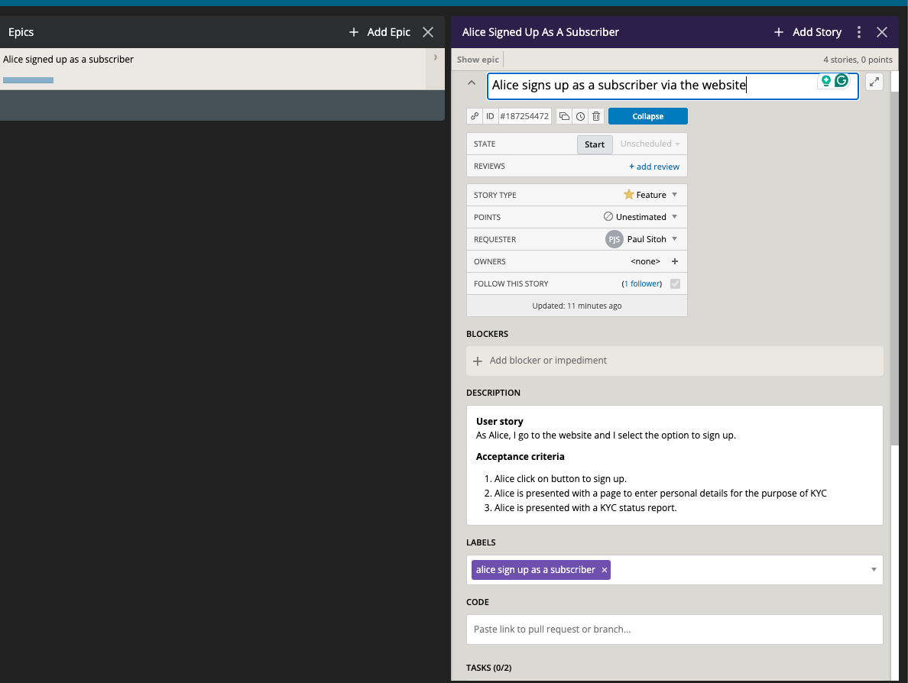
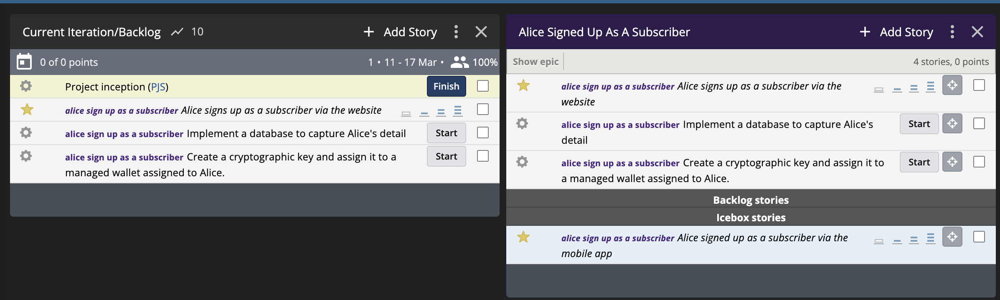

# Managing Projects via User Stories

Let's discuss a technique to manage projects via user stories and the agile methodology.

To facilitate our discussion let's imagine a simulated scenario where we determine that there is a market need for an exchange to enable users to buy bitcoin. Note that the scenario we are using here is to facilitate discussion about user stories and agile principles, not how to build a Bitcoin exchange. Hence, much of the scenario is simplified.

In our goal to build our bitcoin exchange, we'll start from the basis that we are building our product to statisfy the needs of targeted users or personas, rather than roles. This approach follows closely [Design Thinking](https://www.interaction-design.org/literature/topics/design-thinking) philosophy.

Also in keeping with the [Lean Startup](https://theleanstartup.com/) our approach to planning for our project is to focus our attention on what delivers value with minimum effort. Hence, we'll use techniques like [whiteboard architecture](https://tanzu.vmware.com/content/blog/whiteboard-architecture) and the agile methodology.

Keep those two philosophies and methodologies in mind as they will inform us on how users stories are created and organised in our discussion here.

## Context

The first step before we start creating user stories and organising them in a way to reflects our project roadmap is understanding the problem we are trying to solve - in this case, to build a product that people want to use. Typically, this starts with identifying the relationship between personas and our product. We applied the whiteboard architecture and derived a relationship in Figure 1.

</br>
**Figure 1: First iteration of our architecture.**

> NOTE:
> 1. Whiteboard architecture is an approach where we focus on the essence of the problem and what we intend to build to solve the problem. 
> 2. In Figure 1, we don't care exactly what is in the box, we just identify it as something that performs the functionality of an exchange as our first iteration.
> 3. As we evolve our product, we add details to what is meant by an exchange.

We have also identified the following personas as representative of the type of users our product is intended for.

* `Alice` - she is only interested in buying bitcoin but she does not know concepts like private keys or wallet. She just wants something similar to applications she used to buy stocks and shares.
* `Bob` - he is aware of concepts like private keys and wallets. He would like to have the ability to use his own private key but the ability to maintain an account to hold Bitcoin and another cash account integrated to his bank

We have also identified a persona, `Charlie` who is the administrator of our product.

## Terms and definitions

Through this discussion, we use the following terms and definitions.

* `Chore` - This refers to a task we plan to do either for planning purposes, to do research or something we do to fulfil a `user story`. There are several types of chores, which we'll discuss later.

* `Backlog` - A container for user stories and chores. There are several types, which we'll discuss in detail later.

* `Persona` - A fictional character that represents a user type. In line with Design Thinking philosophy, we should be using real human names instead of role names like "user".

* `User story` - A description of a feature of a product as seen from the perspective of a persona. There is a particular way of writing a user story, which will be discussed in detail later.

## User story

A user story is a mechanism used in agile to represent a feature of a product. It is quite common to write a user story from the perspective of a role. For example:

```
As a user, I would like to buy Bitcoin using my bank account from a web portal.
```

A better approach is to write a user story using a persona. Using our exchange scenario, we'll write a user story this way.

```
As Alice, I would like to buy bitcoin using my bank account from a web portal.
```
and
```
As Bob, I would like to buy Bitcoin using my wallet and my bank account from a web portal.
```
Following the classic agile user story format, it should have these elements "As a `persona`, I would like `description of feature`". Optionally, you can include in the user story a phrase to indicate some value proposition like "As a `persona`, I would like `description of feature`, so I can avoid having to deal with technical details". Just remember to focus on features as seen from the perspective of a persona.

Using persona as opposed to using role names is often the case a product is viewed differently by different types of user. Personas help give you fine grain details to decide how many customisations you wish to build in your product.

Often writing user stories can be a deeply cerebral exercise. However, in line with the lean startup methodology of developing things iteratively, and avoiding the analysis paralysis syndrome, the best approach is to start writing user stories loosely and then refine the stories later.

For example, following from the earlier stories, you could refine the story into something more specific like:
```
As Alice, I am presented with the option to sign up for an account, and I elect that option, I am presented with a page to enter my details.
```
Or
```
As Bob, I am presented an option to sign up for an account, and I elect that option, I insert my hardware wallet and I am presented with a page to enter my detail
```

If a user story is ambiguous, the user story could be expressed as an `epic`. An `epic` is a special kind of backlog as it were where it contains an inception chore or `spike` and several smaller or precise user stories.

## Chores

There are essentially three types of chores:

* `Planning chores`.
* `Spikes`.
* `Dependent chores`.

A `planning chore` refers to tasks that you conduct to plan out your user stories. A comprehensive chore could be a conducting design thinking exercise, whiteboard architecture, user story refinement or backlog prioritisation.

A `spike` is typically conducted when we are unsure about what we need to do. In other words, we encounter an `unknown-unknown` scenario such as a user story is so ambiguous or a we don't know what technology to use.

A `dependent chore` is a kind of task we do to build functionality as part of a user story. For example, to fulfil a user story that enables a user to initiate a buy of bitcoin, our tasks are to identify appropriate interface (API or Web3J), caching mechanism, etc.

There is no specific format to writing chores. The rule of thumb is to write sentences that reflect:

* functionality, e.g. `create a Web3J interface`.
* it is a self-contained unit of functionality.

In the case of `dependent chores` it is important to reference those to a specific user story.

## Backlogs

There are four types of backlogs:

* `Icebox`.
* `Product backlog` or simply `backlog`.
* `Sprint`.
* `Epic`.

An `icebox`, is an unordered collection of user stories. You use this as a repository for your initial user stories that you may or may not build. Here you will find user stories in rough cut form. Icebox served as reminders of what you have been thinking about and are a potential candidate for considering as part of your `planning chore`.

A `product backlog` is an order collection of refined `user stories`, `planning chores` and `dependent chores`. Typically, the item at the top of the backlog is the highest priority. An item entered in the `product backlog` is earmarked for action, not deliberation as in the `icebox`.

A `sprint` is a time-limited and ordered collection of `user stories`, `spike` and `dependent chores` commonly used as part of the Sprint/Scrum agile methodologies. We'll discuss this in the later section of Kanban vs Scrum methodologies.

An `epic` is typically a backlog of unordered `spike`, `user stories` and `dependent chores`. This is use to represent a breakdown of an `icebox` user story that has undergone refinement. An `epic` is not be confused with the `product backlog` or `sprint`, it is not an active backlog. You will pick from the `epic` user stories and chores to be assigned to the `product backlog`. Typically, you will pick up `user stories` that are sufficiently well established from the `epic` and start working on them. There may be other `user stories` in it that require further refinement.

## Kanban and scrum methodologies

There are two approaches to managing `user stories` and `chores`:

* `Kanban based`.
* `Scrum based`.

It is beyond the scope of the current discussion to examine the differences. Please refer to Adobe's cloud team's [A detailed comparison between Kanban and Scrum](https://business.adobe.com/blog/basics/kanban-vs-scrum)

The Kanban-based approach is summarised in Figure 2.

</br>
**Figure 2: A Kanban based agile methodology**

The kanban-based approach starts when a user story is refined from the `icebox` and enters the `product backlog`. Planners and developers pick the top-level item and start work. `User stories` are typically refined to the smallest unit of complexity.

An alternative to the Kanban approach is the Scrum approach which is summarised in Figure 3.

<br>
**Figure 3: A scrum-based agile methodology**

A scrum-based approach may not have an `icebox` but there is a notion of one. A typical approach is to place items at the bottom of the `product backlog`. In Figure 3, we left the notion of an `icebox` there as it is a useful mental model.

A `sprint` is a form of time-boxed backlog. Planners and developers work on refining user stories in the `product backlog` via a `planning chore` known as `sprint planning`. This approach differs from the Kanban based which considers all items in the `product backlog` as ready for development any planning is typically done continuously from the `icebox`. There is no fixed time set aside for planning.

Which approach should you use is very much dependent on you. It is beyond the scope of the current discussion to offer value judgement on the approaches.

## Working example

We'll use a tool called Pivotal Tracker to illustrate the use case described earlier. Note: this tool is designed to help users manage projects using the Kanban approach.

Let's imagine we are at the very start of the project. The first item we added to the project backlog is a `planning chore` we titled "project inception" (see Figure 4).

</br>
**Figure 4: Project inception**

From the outcome of the project, we derive several user stories for our `icebox` (see Figure 5).

</br>
**Figure 5: Stories for the Icebox**

We don't need to write user stories for `icebox` in the typical user story format "As ...". We just need to include sufficient details we derived from project inception. For example, Figure 6 includes a detail where `Bob` is familiar with cryptographic wallets.

</br>
**Figure 6: Bob signs up with his wallet**

Following from refinement of user stories in the `icebox` we identify the story name "Alice sign up as a subscriber" as a candidate for conversation to an `epic` see Figure 7.

</br>
**Figure 7: Alice signs up as a subscriber**

The Epic is broken down into a series of detailed user stories and chores. In this case, we have identified one story where `Alice` signs up via the website and other signs up via the mobile app. See Figure 8.

</br>
**Figure 8: Break down Alice signs up as a subscriber**

The user story detailing the feature of `Alice` subscribing via the website is illustrated in Figure 9.

</br>
**Figure 9: Alice subscribing via website**

Having captured sufficient details of user story related to `Alice` subscribing via the website, the story is moved to the `product backlog` and thus ready for implementation (see Figure 10). The dependent chores are also moved to the backlog.

</br>
**Figure 10: Alice subscribing via website**

The cycle continues as more and more user stories are added to the `icebox`, which are refined and converted into `epics` or user stories with minimal complexity adding to the `product backlog`.
